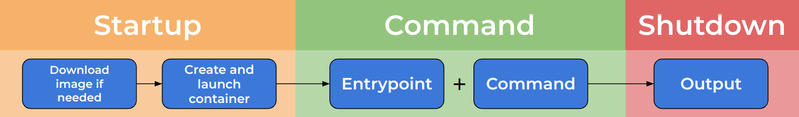
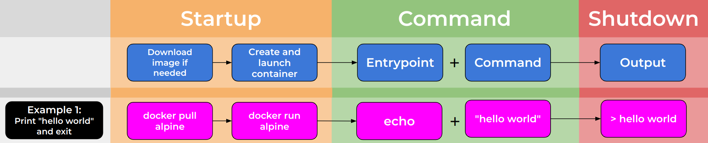
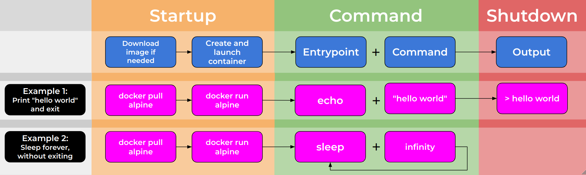
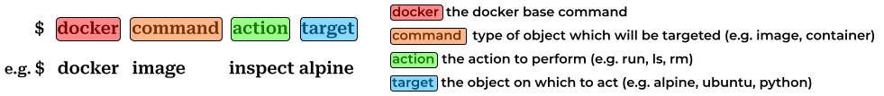

So far, we have seen how easily you can find images and run containers in Docker Desktop. 
However, we have also seen Docker Desktop's limitations, why couldn't we do anything useful with our Alpine container?

To understand this, we need to learn about the lifecycle of Docker containers.

## Container lifecycle ##

So, what happens when we run a Docker container? 

### Startup ###

When we run a Docker container, the first set of actions occur during the "startup" phase:
  * First, Docker checks if you already have the container image, and downloads it if you don't (known as a pull)
  * Next, the container image is used to create the container and start the container's runtime environment

### Default Command ###

Once the container has started, it executes its default command. 

The default command is specified by the image's creator and is formed of two parts:
  * Entrypoint: The base command for the container (may be omitted, default: "")
  * Command: Parameters for the base command (or, if entrypoint omitted, the whole default command)
  
When the container runs, Entrypoint and Command are concatenated to form the default command which is then executed.

### Shutdown ###

Whether a container shuts down depends on the default command. A container will not shutdown until its default process has finished.

Therefore, a command the runs to completion will allow a container to shut down, but a service that runs indefinitely will not.

### Examples ###

Let's take a look at some examples.

#### Example 1 ####

In example 1, an Entrypoint of "echo" is given along with a Command of "hello world" to the container.

This works in exactly the same way as running the following in a standard terminal:

~~~
$ echo hello world
~~~

#### Example 2 ####

In example 2, an Entrypoint of "sleep" is given along with a Command of "infinity" to the container.

This causes the container to run the sleep command indefinitely, meaning that the default command never finishes, and the container stays alive without shutting down.

This example may seem artificial, but it is common to have containers that run indefinitely. A common example would be a webserver which renders a website, running until stopped or changed. 

## Return to Alpine ##

So, how does this explain why the Alpine container seemed so uninteresting? 

First, let's apply what we have learned about the lifecycle of a Docker container. Let's find out what the Entrypoint and Command for the Alpine container are. To do this we will use the Docker command line interface.

### Docker command line syntax ###

The general syntax for the Docker command line explained in this diagram:

There is a base command, always "docker". A specialising command which specifies the type of the object you wish to act on. The action command which select the actual process that will beformed and finally the name of the object you wish to act on. You may also need to add extra arguments and switches.

### Inspecting images ###

Applying this, we want to **inspect** the **image** of **Alpine** to find out the Entrypoint and Command. We can do this by running the command below, where we have specified an extra argument `-f` which is a string specifying the output format of the command (without it we would get a large JSON dump describing the container).

~~~
docker inspect alpine -f "Entrypoint: {{.Config.Entrypoint}} Command: {{.Config.Cmd}}"
~~~
{: .language-bash}

~~~
Entrypoint: [] Command: [/bin/sh]
~~~
{: .output}

So, we can see from this command that Alpine specifies:
  * Entrypoint: null (unspecified)
  * Command: /bin/sh
  
Therefore, the default command for Alpine is: "/bin/sh". 

What is wrong with this? Shouldn't this just open a terminal prompt? 

Not in this case! Running a command in a Docker container is not quite like running it in your terminal. 

When you use your terminal, you are able to type commands and interact with the underlying system. By default however, Docker does not allow containers to do this. Without special measures, a Docker container has no way of recieving interactions and instead sends a empty signal to the sh process. sh is programmed to exit when it recieves an empty signal and therefore finishes its process.

~~~
$ /bin/sh              # you might expect Docker to be running the default command like this
$ /bin/sh < /dev/null  # but actually, it is like this!
~~~

This is why the Alpine contatainer seemed so uninteresting, in Docker Desktop there was no way for us to provide an interactive session to the container! It is possible to change this behavior, but not using Docker Desktop. Instead, we now need to dig in to the more powerful and flexible Docker Command Line Interface.

> This behavior can also be seen on other shell-like containers, for example those with "bash" or "python" as default commands.
{: .callout}

## Running a container ##

~~~
$ docker run alpine
~~~

> ## Downloading containers
>
> When we run docker run, the image we ask for is automatically downloaded.
> If you wanted to download in image without running this is also possible. You can use:
~~~
$ docker pull alpine
~~~
{: .callout}

## Overriding the default command ##

a

~~~
$ docker run alpine echo "hello world"
~~~

b

~~~
$ docker run --entrypoint echo alpine "hello world"
~~~

c

~~~
$ docker run alpine cat /etc/os-release
~~~ 

d

>## Exercise: Make the container use cat as a base command
>
> Can you make the Alpine container use cat as its base command? Can you print the os-release information using this approach?
>
> > ## Solution
> >
> > ~~~
> > $ docker run --entrypoint cat alpine /etc/os-release
> > ~~~
> > {: .language-bash}
> {: .solution}
{: .challenge}

## Running a container interactively ##

~~~
$ docker run -it alpine
~~~ 

## Getting files in to the conatiner ##

## Managing the system ##

### Listing images ###
### Listing containers ###
### Removing images ###
### Removing containers ###

## Conclusion

We have learned about the lifecycle of Docker containers, what happens when they are started and how their behaviour is controled.
We have learned to run containers in the Docker command line interace and how to interact with them directly.




<!--  LocalWords:  keypoints amd64 fce289e99eb9 zen_dubinsky links.md
 -->
<!--  LocalWords:  eager_engelbart endcomment
 -->

