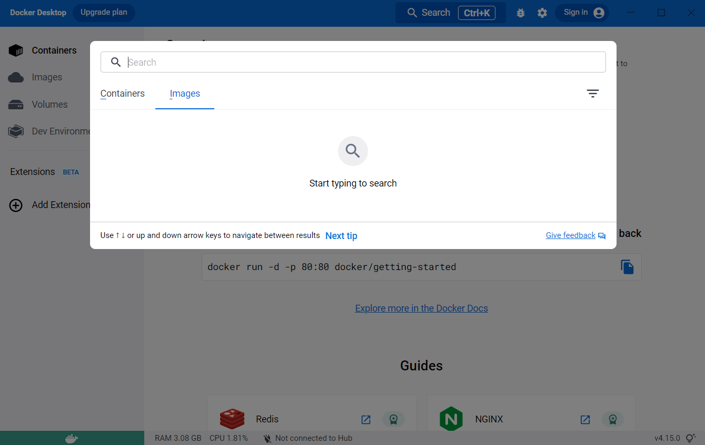
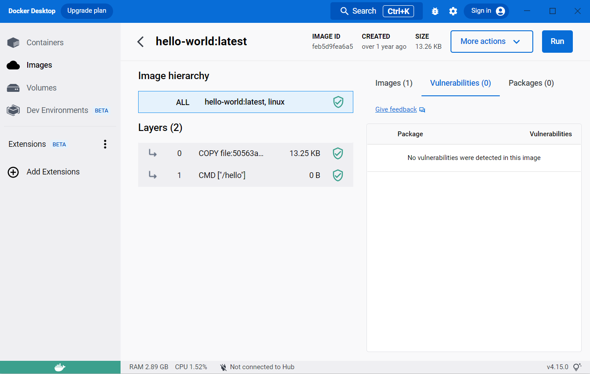
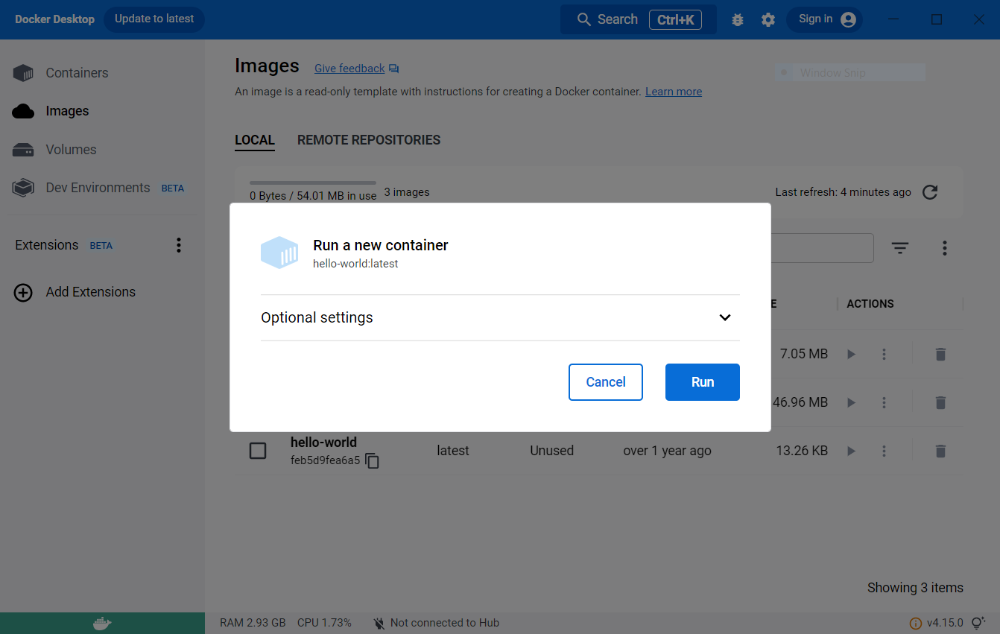
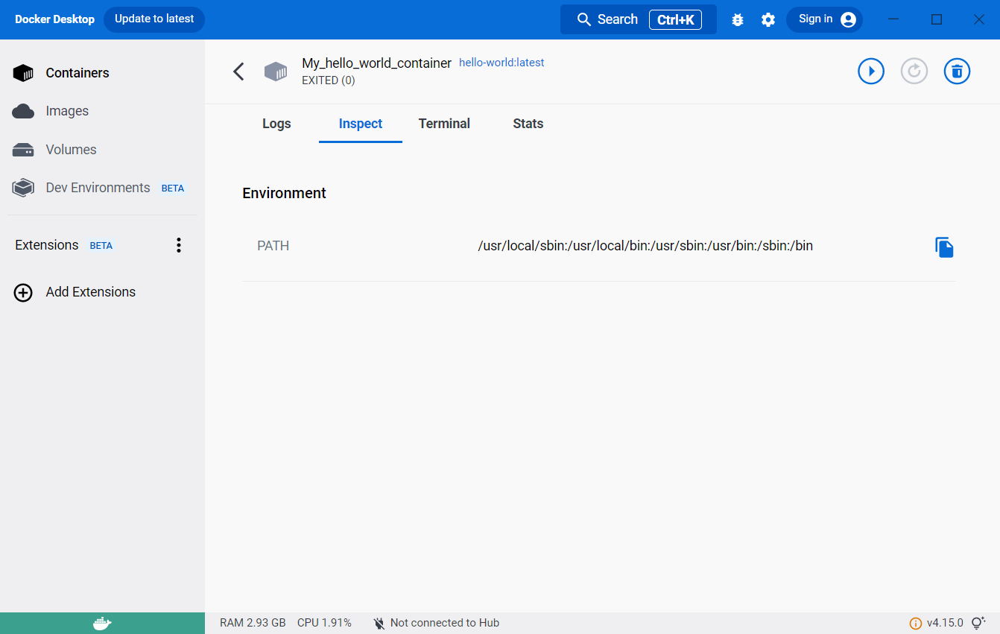
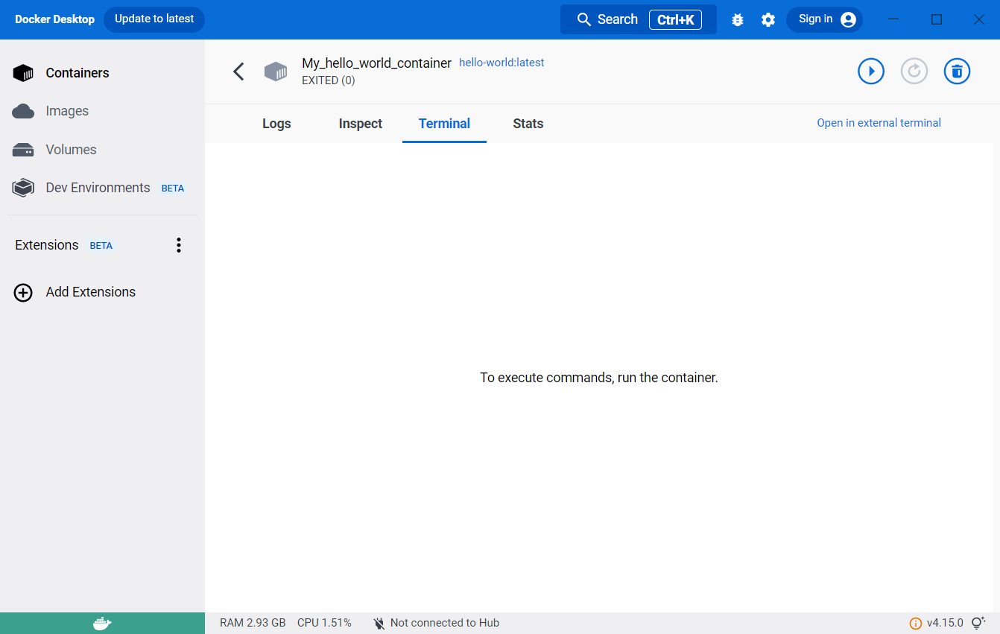
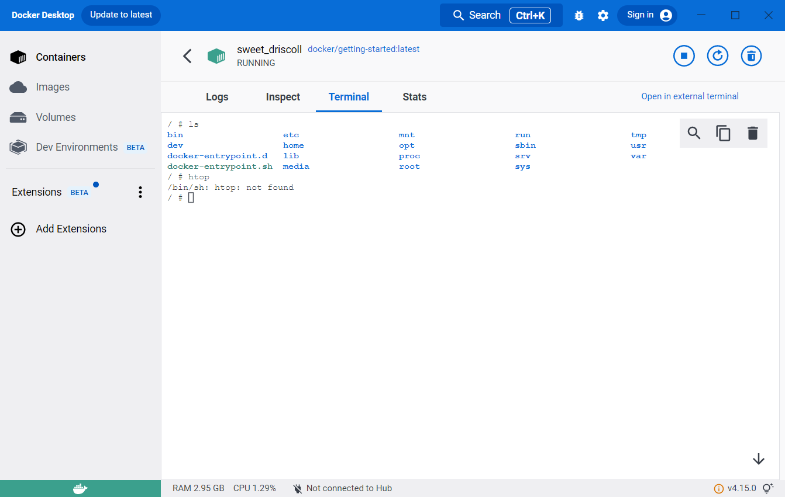
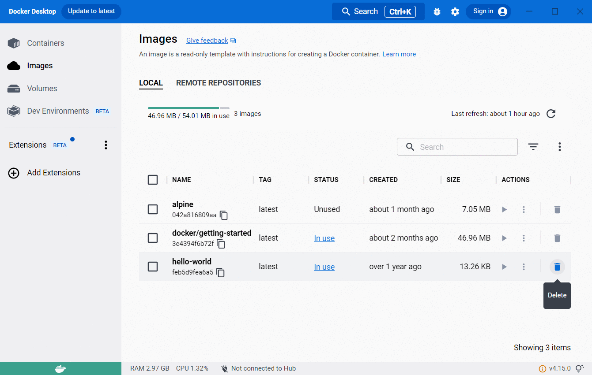
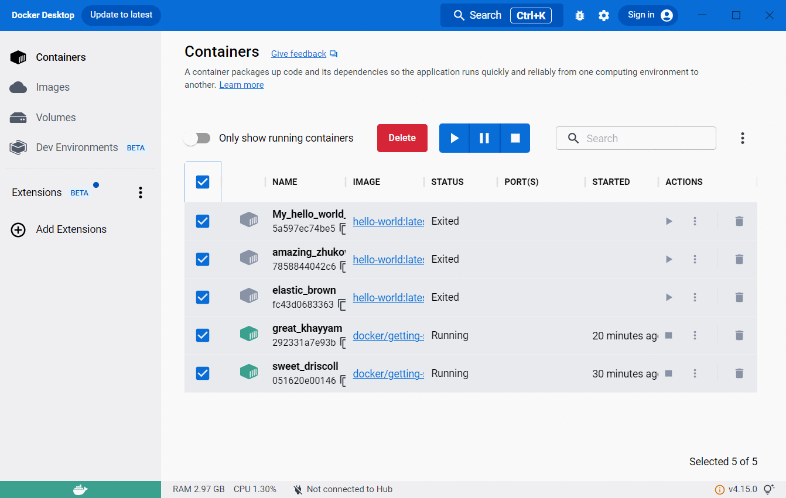
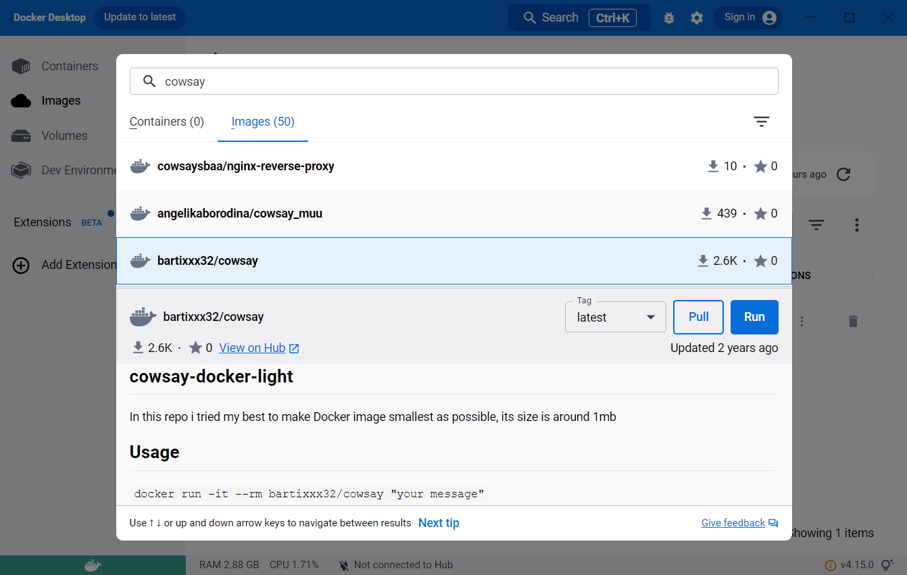
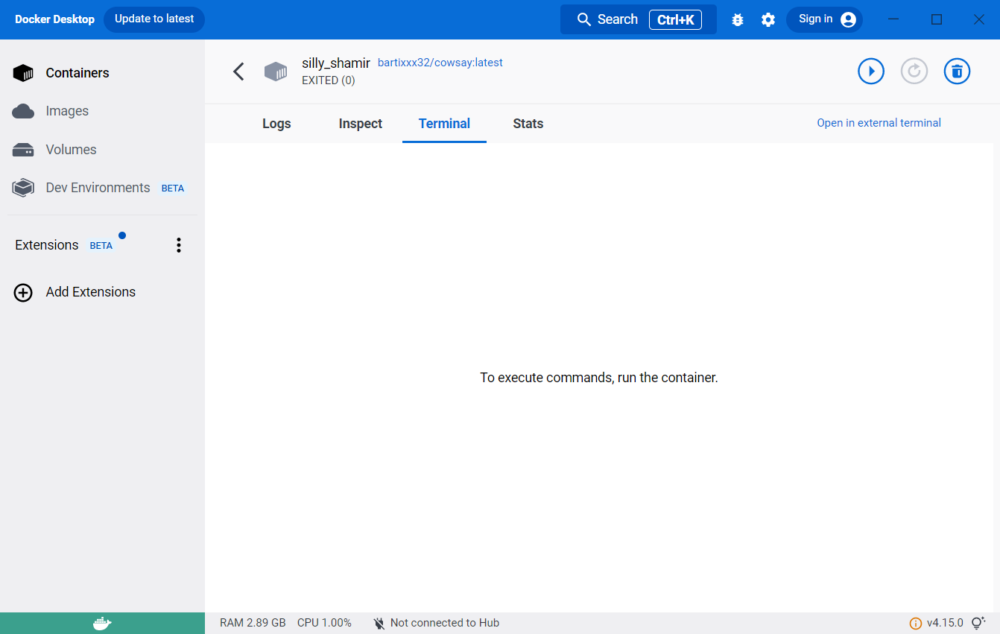

**This episode is meant to be instructional, that is, you do not *need* to follow along.**

We will present the Docker Desktop dashboard, as it will be useful to understand key concepts of docker, such as images and containers.
However, it is important to note that while it is mostly is free, some features are offered as premium.
Also, it is not fully functional on all operating systems; it can produce conflicts with the docker engine on Linux, for example.

## Getting images
Setting up docker in windows or mac will have installed Docker Desktop by default.
If you open the application you will likely see something like this:

You'll notice that the panel on the left has a tab for 'Images' and another for 'Containers'.
These will be the focus for the episode, and we will ignore most other features.

On the top you'll also find a search icon, which links to Docker Hub,
and allows us to search for the images we saw in the previous episode directly from here.

*Note that there are two tabs, one for containers and one for images.
Make sure that you select the right tab when you search!

You can search through the name only,

or include the owner. You can then select the tag from the dropdown menu.

Once you find the image you were looking for, you can either download it (pull), or directly run it.

We'll start by downloading the latest versions of `hello-world`, `docker/getting-started` and `alpine`.

## Inspecting images
The 'Images' tab on the left panel will show all the images in your system, so you will be able to see them here.

From this tab we can see some information about the images on disk, and run them, but we can also inspect the images.
Clicking on the image will open a window with information on how the image is built, and examine its packages and vulnerabilities.

The `hello-world` image does not seem too interesting from here.
If you go to DockerHub you'll find links to the github site, where you'll see it is not as simpleas it looks.
Nevertheless, this is a very nice and quick way to explore an image.

If we now inspect the `docker/getting-started` image, for example, we can see that it detects some vulnerabilities:

You can even further inspect the vulnerable layers by looking at the command

This all looks rather scary, and it is important that we are careful with the images that we download.
It is therefore quite useful to be able to analize them like this.
This image, in particular, is from a verified publisher (Docker Inc. no less!), and has been downloaded over 10M times, so we'll be safe.

## Running containers
The images that we just downloaded are inmutable files, they are snapshots of an environment, distributed to be used as *templates* to create 'containers'.
The containers are, essentially, images being *run*.
They are executions of the image, and because they are running, they are no longer 'static'.

Let's run the `hello-world` image by either clicking the 'Run' button in the 'Actions' column, from the Images tab.

A prompt will ask you to confirm 'Run' or modify some optional settings.

The optional settings allow you to modify the container name, so that you can easily identify it afterwards.
Lets add an appropriate name and confirm with the 'Run' button.

You will likely be taken to a 'Logs' tab inside the container that you just ran.
The logs show the output of this particular image, 'Hello from Docker!' among other things.

If you look carefully, the 'Containers' tab on the left is highlighted.
We are looking at a container now, not an image, and so we were re-located.

Exploring the 'Inspect' tab will show us some information, but for now we are more interested in what the 'Terminal' and 'Stats' tabs have to say.
They both seem to indicate that we need to *run* or *start* the container.

{::options parse_block_html="true" /}

<ul class="nav nav-tabs nav-justified" role="tablist">
  <li role="presentation" class="active">
    <a href="#hw_Logs" aria-controls="hw_Logs" role="tab" data-toggle="tab">Logs</a>  </li>
  <li role="presentation">
    <a href="#hw_Inspect" aria-controls="hw_Inspect" role="tab" data-toggle="tab">Inspect</a>  </li>
  <li role="presentation">
    <a href="#hw_Terminal" aria-controls="hw_Terminal" role="tab" data-toggle="tab">Terminal</a>  </li>
  <li role="presentation">
    <a href="#hw_Stats" aria-controls="hw_Stats" role="tab" data-toggle="tab">Stats</a>  </li>
</ul>

  <article role="tabpanel" class="tab-pane active" id="hw_Logs">
  
  </article>
  <article role="tabpanel" class="tab-pane" id="hw_Inspect">
  
  </article>
  <article role="tabpanel" class="tab-pane" id="hw_Terminal">
  
  </article>
  <article role="tabpanel" class="tab-pane" id="hw_Stats">
  
  </article>

 
{::options parse_block_html="false" /}

Indeed, if we look carefully, we will find an 'Exited (0)' status under the container name, and a 'Start' button near the top-right corner.
However, if we click on that button we will see the output duplicated in the logs, and the 'Exited (0)' status again.

If we go back to the images tab and run the image again (let's not bother giving it a name this time), we'll see that the same thing hapens.
We get the 'Hello from Docker!', and the container exits.

The nature of most containers is *ephimeral*.
They are meant to execute a process, and when the process is completed, they exit.
We can confirm this by clicking on the 'Containers' tab on the left.
This will exit the container inspection and show us all the containers.
Both containers in the list have a status 'Exited'.

Some of you may be wondering why if we have only run the `hello-world` image, you can see there are two containers.
One of the containers we named, and the other has some gibberish as a name (Docker generated this randomly).
As mentioned before, the *image* is used as a template, and as many *containers* as we want can be created from it.
If we go back to the 'Images' tab and run `hello world` again, we'll see a new container appear.

## Interacting with containers

Not all containers are as short lived as the one we've been using.
If we run the `docker/getting-started` image that we had pulled earlier, we will see something different happen.
You can immediately notice the status under the container name is 'RUNNING' now.
The 'Logs' tab is not too informative, but the 'Inspect' tab already shows more information.
A process called 'NginX' is running.
The 'Terminal' and 'Stats' tabs changed the most.
Since the container is still running, the stats get shown, and we are able to launch a terminal *inside* the container.

{::options parse_block_html="true" /}

<ul class="nav nav-tabs nav-justified" role="tablist">
  <li role="presentation" class="active">
    <a href="#gs_Logs" aria-controls="gs_Logs" role="tab" data-toggle="tab">Logs</a>  </li>
  <li role="presentation">
    <a href="#gs_Inspect" aria-controls="gs_Inspect" role="tab" data-toggle="tab">Inspect</a>  </li>
  <li role="presentation">
    <a href="#gs_Terminal" aria-controls="gs_Terminal" role="tab" data-toggle="tab">Terminal</a>  </li>
  <li role="presentation">
    <a href="#gs_Stats" aria-controls="gs_Stats" role="tab" data-toggle="tab">Stats</a>  </li>
</ul>

  <article role="tabpanel" class="tab-pane active" id="gs_Logs">
  
  </article>
  <article role="tabpanel" class="tab-pane" id="gs_Inspect">
  
  </article>
  <article role="tabpanel" class="tab-pane" id="gs_Terminal">
  
  </article>
  <article role="tabpanel" class="tab-pane" id="gs_Stats">
  
  </article>

 
{::options parse_block_html="false" /}

Before trying to do anything in the terminal, let's look at the container list by clicking on the 'Containers' tab on the left.
You'll see the green icon of the container indicating that it is still live, and indication of how long it's been running for.

Clicking on the container name again will take us back to the 'Logs' tab in the container.
Lets try and interact with the terminal inside the container.
If you print the working directory with `pwd` you'll get the base directory: `\`.
You can also list the contents with `ls`, and the `docker-entrypoint` files are a dead giveaway that we are inside the container.
At this point this container is very much like a VM.
We can modify things, like for example making a directory with `mkdir`, and see it has been created with `ls` again.

But we can do more than that, we can install things. For example, you'll notice that `htop` is not installed.
Since the `getting-started` image is based on alpine, we can install it using `apk add htop`, and we can now use it.

{::options parse_block_html="true" /}

<ul class="nav nav-tabs nav-justified" role="tablist">
  <li role="presentation" class="active">
    <a href="#install_htop" aria-controls="install_htop" role="tab" data-toggle="tab">Installing htop</a>  </li>
  <li role="presentation">
    <a href="#htop_running" aria-controls="htop_running" role="tab" data-toggle="tab">Running htop</a>  </li>
</ul>

  <article role="tabpanel" class="tab-pane active" id="install_htop">
  
  </article>
  <article role="tabpanel" class="tab-pane" id="htop_running">
  
  </article>

 
{::options parse_block_html="false" /}

The container does not need to stay alive forever, and you can see that there is a 'stop' icon on the top right.
If we stop the container, we get a familiar empty tab in 'Terminal' and 'Stats'.
The 'Containers' tab on the left will also show the container status as 'Exited'

{::options parse_block_html="true" /}

<ul class="nav nav-tabs nav-justified" role="tablist">
  <li role="presentation" class="active">
    <a href="#gs_stopped_Terminal" aria-controls="gs_stopped_Terminal" role="tab" data-toggle="tab">Terminal</a>  </li>
  <li role="presentation">
    <a href="#gs_stopped_Stats" aria-controls="gs_stopped_Stats" role="tab" data-toggle="tab">Stats</a>  </li>
  <li role="presentation">
    <a href="#gs_stopped_Containers" aria-controls="gs_stopped_Containers" role="tab" data-toggle="tab">Containers</a>  </li>
</ul>

  <article role="tabpanel" class="tab-pane active" id="gs_stopped_Terminal">
  
  </article>
  <article role="tabpanel" class="tab-pane" id="gs_stopped_Stats">
  
  </article>
  <article role="tabpanel" class="tab-pane" id="gs_stopped_Containers">
  
  </article>

 
{::options parse_block_html="false" /}

Now lets say I want to run the `getting-started` image again. So I go to the 'Images' tab, and click run.
Now lets go to the 'Terminal' tab, and try and find our directory with `ls`. The directory is not there.
We'd also installed `htop`. so lets have a go at running it. Not there either.

If this is not surprising to you, it means you're getting the hang of it.
When we re-ran the *image*, we created a **new** *container*.
The new container is created from the template saved in the image, and so 'our' changes have banished.
This becomes very clear when we go back to the 'Containers' tab on the left.
We can see that the first container we created from the `getting-started` image is there, next to
the new container (which is still running, by the way).

## Reviving containers
We *can* get the old container running again, although this is rarely something we'd *want* to do.
In docker desktop, all we need to do is click on the 'Start' button from the 'Containers' list.
The terminal will appear empty, because it is a new session, but you will even be able to 'recall' commands.
### TO DO: Change to tabs instead of gifs?

## Cleaning up
The `hello-world` image was nice and useful to test docker was working, but it is now rather useless.
If I want to delete it, the 'Images' tab on the left has a convenient bin icon to do so.
Clicking on it will prompt you for confirmation, but it will fail.
### TO DO: Change to tabs instead of gifs?

You'll probably notice that the status of the image is 'In use'.
That seems trange though, given that all the containers from that image excited immediately.

Lets have a look at the 'Containers' tab. It shows a list of 5 containers now.
Three of them came from the `hello-world` image, and are stopped.
Two of them came from the `getting-started` image, and are running.

We've only been using Docker for 15 minutes though! You may see how this can become a problem...
Particularly so because we were a bit sloppy and did not name the containers.
Let's try and get rid of the containers then.
We can conveniently select them all with the tickbox at the top, and an option to 'Delete' shows up.
Clicking on it will prompt for confirmation, and we can go ahead and accept.
### TO DO: Change to tabs instead of gifs?

All our containers are now gone. Forever.

***Warning:*** You have to be careful here, this action deleted even the containers that were running.
You can filter the containers before you select them "all".

On the up-side, the 'Images' tab shows both the `hello-world` and the `getting-started` images as 'Unused' now.
For docker, an image is 'In use' as long as at least one container has been created from it.
We have just deleted all the containers created from either of these images.
This tells Docker that they are no longer being used, and can therefore be safely deleted.
### TO DO: Change to tabs instead of gifs?

## Limitations - Why not Docker Desktop?

We have seen many of the neat and functional bits of Docker Desktop, and it can be mighty appealing,
particularly if you lean towards the use of graphical interfaces.
However, we've not touched on its weaknesses.
We'll just need to point at one to feel the need to throw everything overboard.

Let's go ahead and run the only image we have already pulled, `alpine`.

That was fast, and uneventful.
Not even a single output to the 'Logs'.
No way to open a terminal inside Alpine.

{::options parse_block_html="true" /}

<ul class="nav nav-tabs nav-justified" role="tablist">
  <li role="presentation" class="active">
    <a href="#a_Logs" aria-controls="a_Logs" role="tab" data-toggle="tab">Logs</a>  </li>
  <li role="presentation">
    <a href="#a_Inspect" aria-controls="a_Inspect" role="tab" data-toggle="tab">Inspect</a>  </li>
  <li role="presentation">
    <a href="#a_Terminal" aria-controls="a_Terminal" role="tab" data-toggle="tab">Terminal</a>  </li>
  <li role="presentation">
    <a href="#a_Stats" aria-controls="a_Stats" role="tab" data-toggle="tab">Stats</a>  </li>
</ul>

  <article role="tabpanel" class="tab-pane active" id="a_Logs">
  
  </article>
  <article role="tabpanel" class="tab-pane" id="a_Inspect">
  
  </article>
  <article role="tabpanel" class="tab-pane" id="a_Terminal">
  
  </article>
  <article role="tabpanel" class="tab-pane" id="a_Stats">
  
  </article>

 
{::options parse_block_html="false" /}

Just to be clear though, this Docker image does contain the whole Alpine OS.
In Docker Desktop, however, there is no way to interact with it.

Let's try something different.
There's a program called `cowsay` that lets you print messages as if a cow was saying them.
Searching for that image shows that there is one by `beatrixxx32` with a reasonable number of downloads.

So lets pull that image and run it.

{::options parse_block_html="true" /}

<ul class="nav nav-tabs nav-justified" role="tablist">
  <li role="presentation" class="active">
    <a href="#c_Logs" aria-controls="c_Logs" role="tab" data-toggle="tab">Logs</a>  </li>
  <li role="presentation">
    <a href="#c_Inspect" aria-controls="c_Inspect" role="tab" data-toggle="tab">Inspect</a>  </li>
  <li role="presentation">
    <a href="#c_Terminal" aria-controls="c_Terminal" role="tab" data-toggle="tab">Terminal</a>  </li>
  <li role="presentation">
    <a href="#c_Stats" aria-controls="c_Stats" role="tab" data-toggle="tab">Stats</a>  </li>
</ul>

  <article role="tabpanel" class="tab-pane active" id="c_Logs">
  
  </article>
  <article role="tabpanel" class="tab-pane" id="c_Inspect">
  
  </article>
  <article role="tabpanel" class="tab-pane" id="c_Terminal">
  
  </article>
  <article role="tabpanel" class="tab-pane" id="c_Stats">
  
  </article>

 
{::options parse_block_html="false" /}

We do get a cow this time, but it is not saying anything.
But it does not know *what* to say.
Going back to the cowsay image search, you may notice that in 'Usage' the command line asks for "your message".
We are not using a command though, we just clicked *run*.
Maybe we missed something in the optional settings!

No, it does not seem like it.
No matter what we do, we cannot make the cow say anything from here.

Are the alpine and cowsay images useless? No, definitely not.
However, they are expecting some sort of input or command, which we cannot provide from Docker Desktop.

This is the case for most images, and so Docker Desktop (as it is now) cannot really be used for much more than as a nice dashboard.

In the next episode, we will use docker from the command line, and all of the advantages it brings will become aparent.


