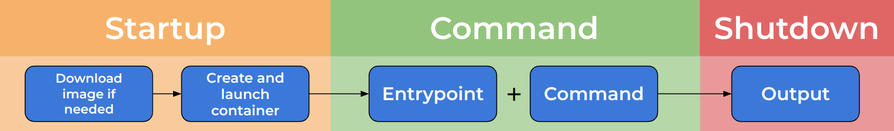
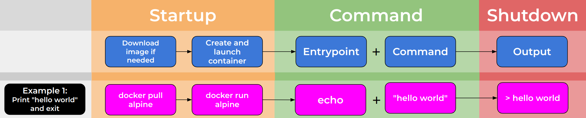
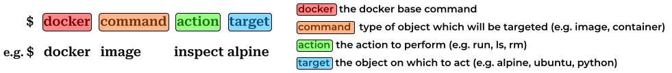
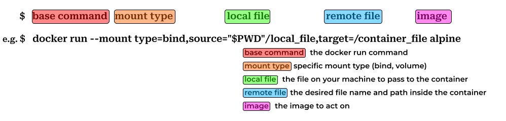

So far, we have seen how easily you can find images and run containers in Docker Desktop.
However, we have also seen Docker Desktop's limitations, why couldn't we do anything useful with our Alpine container?

::::::::::::::::::::::::::::::::::::::: objectives

- Learn the lifecycle of Docker containers
- Learn how to use the Docker command line to perform tasks we learned to do in Docker Desktop
- Learn to perform more advanced Docker tasks, only possible in the command line

::::::::::::::::::::::::::::::::::::::::::::::::::

:::::::::::::::::::::::::::::::::::::::: questions

- What actually happens when I run a container?
- How can I control the behaviour of containers?

::::::::::::::::::::::::::::::::::::::::::::::::::

To understand this, we need to learn about the lifecycle of Docker containers.

## Container lifecycle

So, what happens when we run a Docker container?

{alt='A flowchart showing the lifecycle of a Docker container.'}

### Startup

When we run a Docker container, the first set of actions occur during the "startup" phase:

- First, Docker checks if you already have the container image, and downloads it if you don't (known as a pull)
- Next, the container image is used to create the container and start the container's runtime environment

### Default Command

Once the container has started, it executes its default command.

The default command is specified by the image's creator and is formed of two parts:

- Entrypoint: The base command for the container (may be omitted, default: "")
- Command: Parameters for the base command (or, if entrypoint omitted, the whole default command)

When the container runs, Entrypoint and Command are concatenated to form the default command which is then executed.

### Shutdown

Whether a container shuts down depends on the default command. A container will not shutdown until its default process has finished.

Therefore, a command the runs to completion will allow a container to shut down, but a service that runs indefinitely will not.

### Examples

Let's take a look at some examples.

#### Example 1

{alt='A flowchart showing the lifecycle of a Docker container. with an example'}

In example 1, an Entrypoint of "echo" is given along with a Command of "hello world" to the container.

This works in exactly the same way as running the following in a standard terminal:

```
$ echo hello world
```

#### Example 2

{alt='A flowchart showing the lifecycle of a Docker container. with an example'}

In example 2, an Entrypoint of "sleep" is given along with a Command of "infinity" to the container.

This causes the container to run the sleep command indefinitely, meaning that the default command never finishes, and the container stays alive without shutting down.

This example may seem artificial, but it is common to have containers that run indefinitely. A common example would be a webserver which renders a website, running until stopped or changed.

## Return to Alpine

So, how does this explain why the Alpine container seemed so uninteresting?

First, let's apply what we have learned about the lifecycle of a Docker container. Let's find out what the Entrypoint and Command for the Alpine container are. To do this we will use the Docker command line interface.

### Docker command line syntax

The general syntax for the Docker command line explained in this diagram:

{alt='A diagram showing the syntactic structure of a Docker command'}

There is a base command, always "docker". A specialising command which specifies the type of the object you wish to act on. The action command which select the actual process that will beformed and finally the name of the object you wish to act on. You may also need to add extra arguments and switches.

### Inspecting images

Applying this, we want to **inspect** the **image** of **Alpine** to find out the Entrypoint and Command. We can do this by running the command below, where we have specified an extra argument `-f` which is a string specifying the output format of the command (without it we would get a large JSON dump describing the container).

```
docker inspect alpine -f "Entrypoint: {{.Config.Entrypoint}} Command: {{.Config.Cmd}}"
~~~
{: .language-bash}

```

Entrypoint: [] Command: [/bin/sh]

```
{: .output}

So, we can see from this command that Alpine specifies:
  * Entrypoint: null (unspecified)
  * Command: /bin/sh
  
Therefore, the default command for Alpine is: "/bin/sh". 

What is wrong with this? Shouldn't this just open a terminal prompt? 

Not in this case! Running a command in a Docker container is not quite like running it in your terminal. 

When you use your terminal, you are able to type commands and interact with the underlying system. By default however, Docker does not allow containers to do this. Without special measures, a Docker container has no way of recieving interactions and instead sends a empty signal to the sh process. sh is programmed to exit when it recieves an empty signal and therefore finishes its process.

```

$ /bin/sh              # you might expect Docker to be running the default command like this
$ /bin/sh \< /dev/null  # but actually, it is like this!

```

This is why the Alpine contatainer seemed so uninteresting, in Docker Desktop there was no way for us to provide an interactive session to the container! It is possible to change this behavior, but not using Docker Desktop. Instead, we now need to dig in to the more powerful and flexible Docker Command Line Interface.

> This behavior can also be seen on other shell-like containers, for example those with "bash" or "python" as default commands.
{: .callout}


## Running a container ##

So, how does the Docker command line address this? Can we use the Docker CLI to interact with our containers? 

Let's now focus on running Docker containers using the CLI.

Again, we will use the docker base command, this time specialising this command with 'run' and the name of an image; to tell Docker that we want to start up the specified container image.

```

$ docker run alpine

```

You will likely see output similar to the below:

```

> \##Unable to find image 'alpine:latest' locally
> latest: Pulling from library/alpine
> f56be85fc22e: Already exists
> Digest: sha256:124c7d2707904eea7431fffe91522a01e5a861a624ee31d03372cc1d138a3126
> Status: Downloaded newer image for alpine:latest

```
{: .output}

This output shows docker recognising that it does not have the Alpine image locally, and beginning the process of downloading and storing the image. 

But is something missing? We don't see any other output? Let's run the command again.

```

$ docker run alpine

```

```

> 
```
{: .output}

This time there is no output at all, with the image already downloaded it is able to run without downloading. But why is no output produced? This is for the same reason as when we tried running Alpine in Docker Desktop (as explained above), the Docker run command is not sending any commands, and the default command exits automatically.

>## Downloading containers
> When we run docker run, the image we ask for is automatically downloaded.
> If you wanted to download in image without running this is also possible. You can use:
```

$ docker pull alpine

```
{: .callout}

Why don't we finally try and make Alpine do something?

## Overriding the default command ##

To get the Alpine image to do something interesting; we will want to overwrite the default command.

This can be done in the Docker CLI, by specifying the desired command, after the docker run command and image name.

For example, if we wanted the Alpine container to print "hello world", we could use the standard Unix command, echo.

```

$ docker run alpine echo "hello world"

```

```

> hello world

```
{: .output}

Great! We have finally managed to do something interesting with the Alpine image. 

This is a big step, but how can we evolve from here? What if we tried to generalise our printing command?

We can do this by modifying the entrypoint portion of the default command (remember: the entrypoint is the portion of the default command which prefixes the command that comes after the image name).

This way we can have just the text we want to print after the image name.

We do this by adding the '--entrypoint' switch to our Docker command, followed by the command we want to become the entrypoint.

```

$ docker run --entrypoint echo alpine "hello world"
$ docker run --entrypoint echo alpine "lovely day"

```
```

> hello world
> lovely day

```
{: .output}

Wonderful! But this needn't be limited to just echo, let's use this approach to get some more information about the container, by printing the contents of a special file called 'os-release'.

```

$ docker run alpine cat /etc/os-release

```
```

NAME="Alpine Linux"
ID=alpine
VERSION\_ID=3.17.3
PRETTY\_NAME="Alpine Linux v3.17"
HOME\_URL="[https://alpinelinux.org/](https://alpinelinux.org/)"
BUG\_REPORT\_URL="[https://gitlab.alpinelinux.org/alpine/aports/-/issues](https://gitlab.alpinelinux.org/alpine/aports/-/issues)"

```
{: .output}

>## Exercise: Make the container use cat as a base command
>
> Can you make the Alpine container use cat as its base command? Can you print the os-release information using this approach?
>
> > ## Solution
> >
> > ~~~
> > $ docker run --entrypoint cat alpine /etc/os-release
> > ~~~
> > {: .language-bash}
> {: .solution}
{: .challenge}

>## Exercise: Print the users present in the Alpine container
>
> Can you make the Alpine container print the contents of the /etc/passwd file? (which contains details of the registered users of a Linux system)
>
> > ## Solution
> >
> > ~~~
> > $ docker run --entrypoint cat alpine /etc/passwd
> > ~~~
> > or 
> > ~~~
> > $ docker run alpine cat /etc/passwd
> > ~~~
> > {: .language-bash}
> {: .solution}
{: .challenge}


We can see from the output that we are indeed running in an Alpine container and now have a powerful way to execute single commands in a Docker container.

## Running a container interactively ##

But what if we wanted to run a series of commands? What if we wanted to be able to explore within a container? 

We will look now at how we can create interactive sessions for using Docker containers.

Luckily this is straightforward, we simply need to modify our standard Docker command to include two new flags.

We need to add:
* '-i' to enable interactivity 
* '-t' to enable a TTY connection (the ability to type things!)

Let's try this with the Alpine image:

```

$ docker run -i -t alpine

```
```

/ #

```
{: .output}

You are now inside the container! Let's try some familiar commands.

```

/ # cat /etc/os-release

```
```

NAME="Alpine Linux"
ID=alpine
VERSION\_ID=3.17.3
PRETTY\_NAME="Alpine Linux v3.17"
HOME\_URL="[https://alpinelinux.org/](https://alpinelinux.org/)"
BUG\_REPORT\_URL="[https://gitlab.alpinelinux.org/alpine/aports/-/issues](https://gitlab.alpinelinux.org/alpine/aports/-/issues)"

```
{: .output}

You can see we get the same output as earlier, but this time the container remains live and we remain inside the container.

You can now exit the container by running:

```

/ # exit

```

Using containers in this interactive way can be useful, but we have to be careful as (by default) our changes will not persist.

You can see this for yourself with the following process

```

$ docker run -i -t alpine
/ # touch hello-world
/ # echo "hi everyone" > hello-world
/ # cat hello-world
/ # exit
$ docker run -i -t alpine
/ # cat hello-world

```
```

First time:

> hi everyone
> Second time:
> cat: can't open 'hello-world': No such file or directory

```
{: .output}

You can see that, while we were still interacting with the container, our file continued to exist. Once we left, it was gone!

## Getting files in to the container ##

Now that we are figuring out how to work with containers, let's imagine a situation. We are working in a data science lab, and our supervisor has asked us to run some tools that they have developed; which they are distributing in Docker.

The first tool, called Random, generates a series of random numbers. The second tool, named Datamash, performs simple statistical analyses on single columns of data. Let's figure out how to use these tools and some of the hurdles we will have to overcome.

First, let's download the tools:

```

$ docker pull ghcr.io/uomresearchit/random
$ docker pull ghcr.io/uomresearchit/datamash

```

Great! But... how can we check what has happened? How can we know we have the images? Let's check with:

```

$ docker image ls

```
```

REPOSITORY                                       TAG                            IMAGE ID       CREATED         SIZE
ghcr.io/uomresearchit/datamash                   latest                         a0143c45d868   5 minutes ago   49.7MB
ghcr.io/uomresearchit/random                     latest                         b39bc463abfd   6 weeks ago     7.04MB

```
{: .output}

You should see output similar to the above, with the images we just pulled listed.

Now we have the tools let's try running them. We'll start by generating our data:

```

$ docker run ghcr.io/uomresearchit/random

```
```

[...]
[Lot's of numbers!]
[...]
22307
21278
28211
21151
9209

```
{: .output}

We can see this produces a **lot** of output. Let's write it to file instead:

```

$ docker run ghcr.io/uomresearchit/random > local\_data.txt

```

We now have a datafile we can use on our other tool. Our supervisor has told us a couple of helpful things about this container, apparently all you have to do is give the container the filename you want to analyse.

Let's try that! 

```

$ docker run ghcr.io/uomresearchit/datamash local\_data.txt

```
```

Traceback (most recent call last):
File "//mean.py", line 7, in <module>
with open(args.filename) as f:
FileNotFoundError: [Errno 2] No such file or directory: 'local\_data.txt'

```
{: .output}

We gave the right filename... So why hasn't this worked? The answer is simple, but has profound implications. 

The file we specified is present on our machine, but not inside the container! The container has its own, completely isolated filesystem.

This can really help, the container's file are stored in a nice, safe, isolated place perfectly tailored for the application. But then, how can we give our file to the container, in order for it to be analysed?

### Using mounts and volumes ###

Docker's answer to this is to allow you to selectively expose files and folders on your machine to the container you are running.

Docker calls these bind mounts and they take the following form:



Using this command we specify the type of mount we want (more on this later!), the name of a local file (or directory) to mount to the container and the path and filename which we would like inside the container.

>## $PWD
> You will notice we used an envirnoment variable (denoted by $) to specify the location of our local file.
> This is because the docker command needs the full path to a file to mount correctly, it wont work if you do ./local_file.txt!"
{: .callout}

Let's try this out with our datamash container:

```

$ docker run --mount type=bind,source="$PWD"/local\_data.txt,target=/local\_data.txt ghcr.io/uomresearchit/datamash local\_data.txt

```
```

Data file data.txt, selected.
Number of entries: 100.0
Sum: 1681522.0
Mean: 16815.22

```
{: .output}

Wonderful! The container works now. But that syntax is very clunky... Can it be shortened? The answer is yes, but it requires care - let's investigate.

Try out the following command:

```

$ docker run -v $PWD/data.txt:/data.txt ghcr.io/uomresearchit/datamash data.txt

```

It works just like before! But there is a hidden danger here.

So far we have only discussed bind mounts. These are a simple mechanism for binding bits of your local filesystem into containers. There is another method for getting files into container, called volumes.

Volumes are the isolated, persistent filesystems for containers, they can be shared between containers and are very useful for retaining information between container runs.

However, they are not particularly useful for getting files from host to container!

Can you spot the difference?

```

$ docker run -v data.txt:/data.txt ghcr.io/uomresearchit/datamash data.txt

```
```

Traceback (most recent call last):
File "//mean.py", line 7, in <module>
with open(args.filename) as f:
IsADirectoryError: [Errno 21] Is a directory: 'data.txt'

```
{: .output}

Why has this not worked? The answer is that Docker has created a volume! Not mounted our file! This is because the Docker command requires absolute paths, if a path doesn't evaluate correclty then it assumes you are naming a new volume.

See this bit of the Docker man page:

```

\-v|--volume[\=[[HOST-DIR:]CONTAINER-DIR[:OPTIONS]]]
Create a bind mount. If you specify, -v /HOST-DIR:/CONTAINER-DIR, Docker
bind mounts /HOST-DIR in the host to /CONTAINER-DIR in the Docker
container. If 'HOST-DIR' is omitted,  Docker automatically creates the new
volume on the host.

```

For this reason, we would recommend using the full (clunky) syntax of the mount command.

## Running services in Docker ## 

This impermanence can be a challenge! What if we 

## Long running processes ##

docker container with python analysis built in and simple upload portal

## Docker Exec ## 

### Copying files ###

docker cp


## Docker ps ##


## Managing the system ##

docker stats
### Removing images ###
docker image rm
### Removing containers ###
docker rm
### Removing images and containers ###
docker system prune
docker system prune -a 


## Sum up ##

docker run --rm --name mydocker --entrypoint thing --mount

in compose

## Conclusion

We have learned about the lifecycle of Docker containers, what happens when they are started and how their behaviour is controled.
We have learned to run containers in the Docker command line interace and how to interact with them directly.




<!--  LocalWords:  keypoints amd64 fce289e99eb9 zen_dubinsky links.md
 -->
<!--  LocalWords:  eager_engelbart endcomment
 -->



```

:::::::::::::::::::::::::::::::::::::::: keypoints

- asdf
- asdf
- asdf

::::::::::::::::::::::::::::::::::::::::::::::::::


