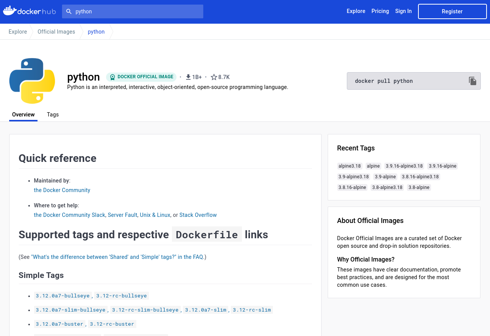
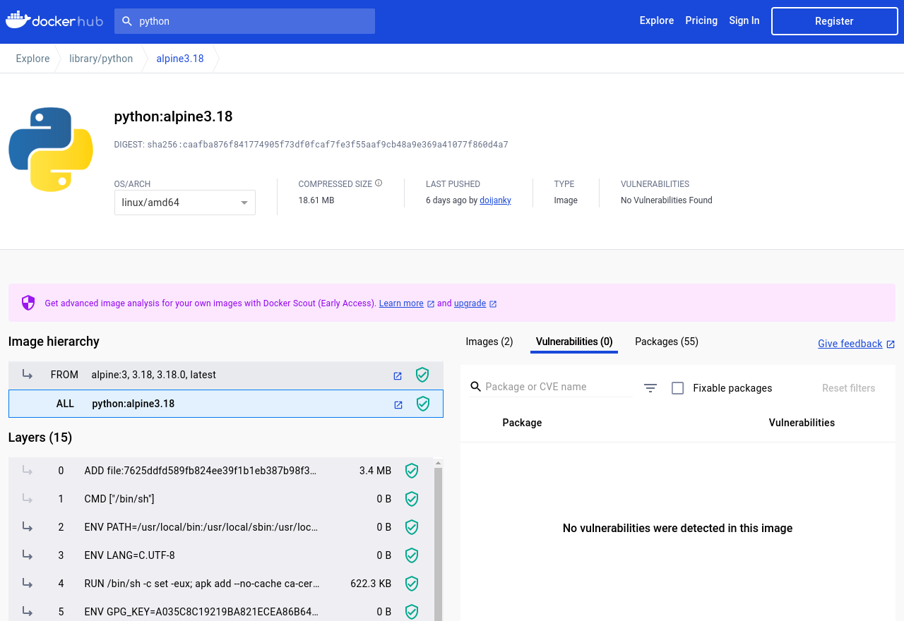
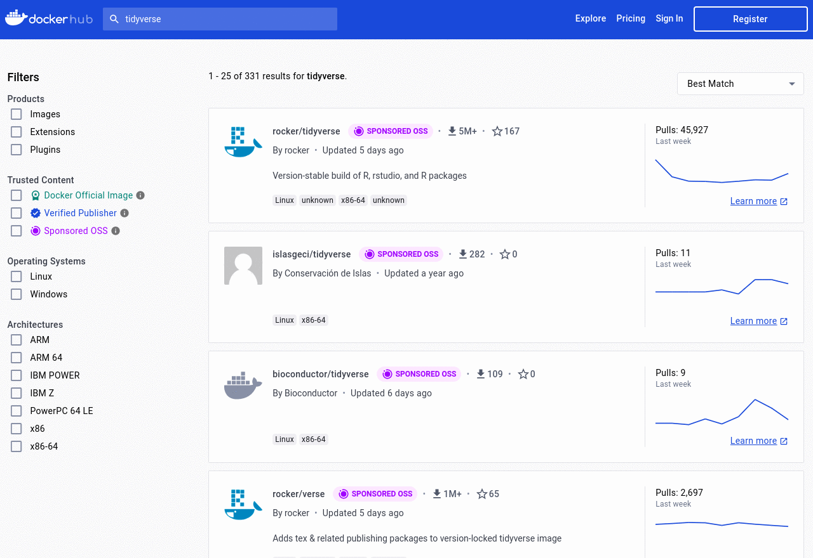
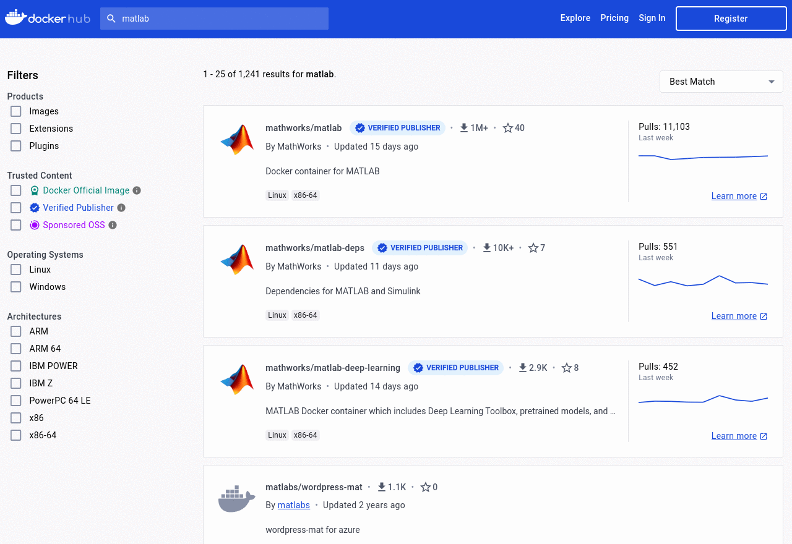
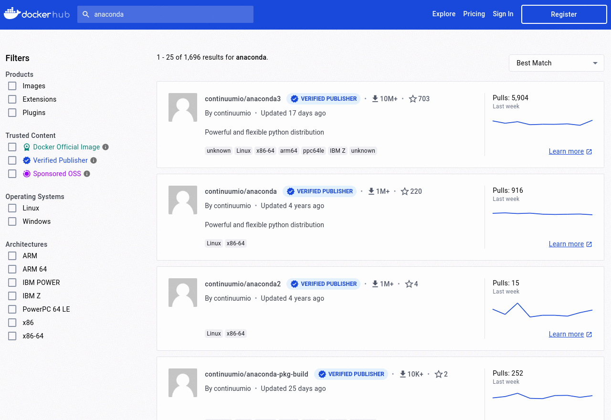

One of the reasons why Docker is useful is that there is a lot of content (container images) already prepared to be used.
Each container image represents a complete software
installation that you can use and access without any extra work!


::::::::::::::::::::::::::::::::::::::: objectives
- Explore the Docker Hub webpage for a popular Docker container image.
- Find the list of tags for a particular Docker container image.
- Identify the three components of a container image's identifier.
::::::::::::::::::::::::::::::::::::::::::::::::::


:::::::::::::::::::::::::::::::::::::::: questions
- What is the Docker Hub, and why is it useful?
::::::::::::::::::::::::::::::::::::::::::::::::::


A lot of these images are hosted in the Docker Hub.


## Introducing the Docker Hub

The Docker Hub is an online repository of container images, a vast number of which are publicly available.
A large number of the container images are curated by the developers of the software that they package.
Also, many commonly used pieces of software that have been containerized into images are officially endorsed,
which means that you can trust the container images to have been checked for functionality,
stability, and that they don't contain malware.


:::::::::::::::::::::::::::::::::::::::::  callout
## Docker can be used without connecting to the Docker Hub

Note that while the Docker Hub is well integrated into Docker functionality,
the Docker Hub is certainly not required for all types of use of Docker containers.
For example, some organizations may run container infrastructure that is entirely disconnected from the Internet.
::::::::::::::::::::::::::::::::::::::::::::::::::


## Exploring an example Docker Hub page

As an example of a Docker Hub page, let's explore the page for the official Python language container images.
Open your web browser to [https://hub.docker.com](https://hub.docker.com)

{alt='Dockerhub\_landing'}

We will need to register for the later stages of this course, so feel free to do so now if you are not already.

In the search bar type "python" and hit enter.

{alt='Dockerhub\_search'}

You should see a list of images related to python.
We can immediately get a feel of the sheer number of container images hosted here.
There is upwards from 10,000 images related to python alone.

There is also some useful information that can help us choose the image that we want, which we will point out in a moment.

For now, lets go to the top result, the [python](https://hub.docker.com/_/python) container image
(which is endorsed by the Docker team) to see what is on a typical Docker Hub software page.

{alt='Dockerhub\_python'}

The top-left provides information about the name, short description,
popularity (i.e., more than a billion downloads in the case of this container image), and endorsements.

The top-right provides the command to pull this container image to your computer.

The main body of the page contains many used headings, such as:

- Which tags (i.e., container image versions) are supported.
- Summary information about where to get help, which computer architectures are supported, etc.
- A longer description of the container image.
- Examples of how to use the container image.
- The license that applies.

The "How to use the image" section of most container images' pages will provide examples that are likely to cover your intended use of the container image.


## Container Image versions and owners

A single Docker Hub page can have many different versions of container images, based on the version of the software inside.
These versions are indicated by "tags".
When referring to the specific version of a container image by its tag, you use a colon, `:`, like this:
```
CONTAINER_IMAGE_NAME:TAG
```
If we click the version tag for `alpine3.18` of this image, Docker Hub shows it as `python:alpine3.18`

{alt='Dockerhub\_python'}

The default tag (which is used if you don't specify one) is called `latest`.

This container image is a "Docker Official Image", which means that the docker team mantains it and guarantees it.
However, it's equally common to use container images that have been produced by individual owners
or organizations. Container images that you create and upload to Docker Hub would fall
into this category, as would the container images maintained by organizations like
[ContinuumIO](https://hub.docker.com/u/continuumio) (the folks who develop the Anaconda Python environment) or community
groups like [rocker](https://hub.docker.com/u/rocker), a group that builds community R container images.

In these cases, the "owner", that is the  group- or individual- that manage the container image is part of the image name, and it is given in the format:
```
OWNER/CONTAINER_IMAGE_NAME:TAG
```
as can be seen in these examples

<br/>

:::::::::::::::: solution
### rocker/tidyverse:latest
{alt='rocker/tidyverse:latest'}
:::::::::::::::::::::::::
:::::::::::::::: solution
### mathworks/matlab:r2022b
{alt='mathworks/matlab'}
:::::::::::::::::::::::::
:::::::::::::::: solution
### continuumio/anaconda3:master
{alt='continuumio/anaconda3'}
:::::::::::::::::::::::::


:::::::::::::::::::::::::::::::::::::::::  callout
## Repositories

The technical name for the contents of a Docker Hub page is a "repository."
The tag indicates the specific version of the container image that you'd like
to use from a particular repository. So a slightly more accurate version of
the above example is:
```
OWNER/REPOSITORY:TAG
```
::::::::::::::::::::::::::::::::::::::::::::::::::


## Choosing Container Images on Docker Hub

Note that anyone can create an account on Docker Hub and share container images there,
so it's important to exercise caution when choosing a container image on Docker Hub. These
are some indicators that a container image on Docker Hub is consistently maintained,
functional and secure:

- The container image is updated regularly.
- The container image associated with a well established company, community, or other group that is well-known.
  Docker helps with badges to mark official images, verified publishers and sponsored open source software.
- There is a Dockerfile or other listing of what has been installed to the container image.
- The container image page has documentation on how to use the container image.
- The container image is used by the wider community.
  The graph on the right at the search page can help with this.

If a container image is never updated, created by a random person, and does not have a lot
of metadata, it is probably worth skipping over. Even if such a container image is secure, it
is not reproducible and not a dependable way to run research computations.

## Other sources of Container Images

Although many of the containers made for docker are hosted in the Docker Hub, there are other places where these can be distributed, including (but not limited to):

- [GHCR](https://github.com/features/packages) from Github.
- [Quay](https://quay.io/) from Red Hat.
- [Artifact Registry](https://cloud.google.com/artifact-registry) from Google.
- [GLR](https://docs.gitlab.com/ee/user/packages/container_registry/) from GitLab.
- [ECR](https://aws.amazon.com/ecr/) from Amazon.
- [ACR](https://azure.microsoft.com/en-us/products/container-registry) from Azuere, Microsoft.


:::::::::::::::::::::::::::::::::::::::: keypoints
- The Docker Hub is an online repository of container images.
- Many Docker Hub container images are public, and may be officially endorsed.
- Each Docker Hub page about a container image provides structured information and subheadings
- Most Docker Hub pages about container images contain sections that provide examples of how to use those container images.
- Many Docker Hub container images have multiple versions, indicated by tags.
- The naming convention for Docker container images is: `OWNER/CONTAINER_IMAGE_NAME:TAG`
::::::::::::::::::::::::::::::::::::::::::::::::::
